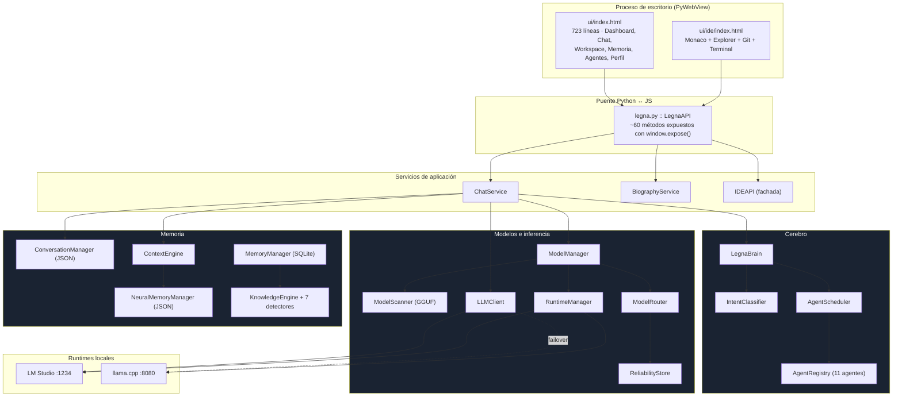
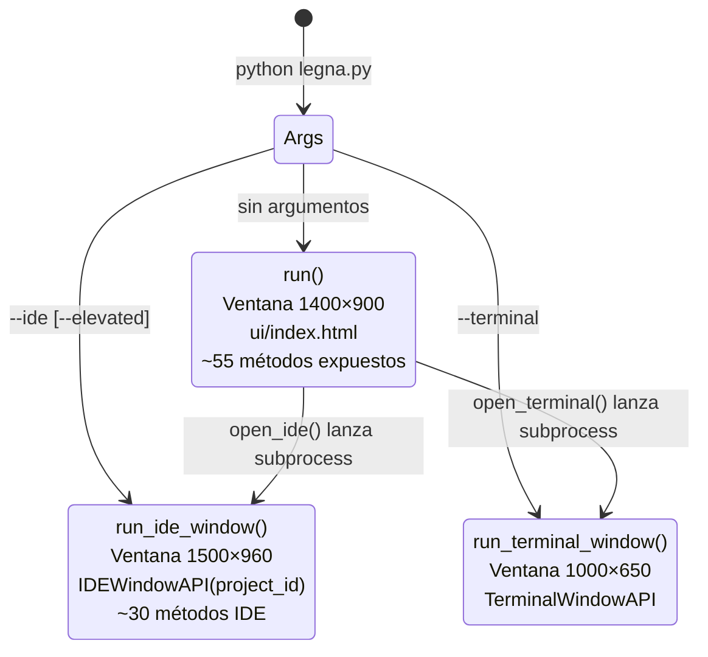
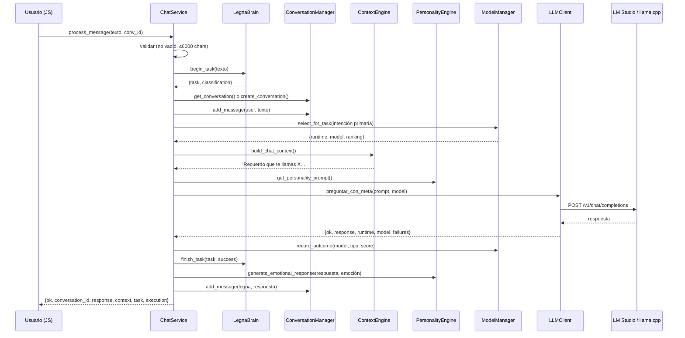
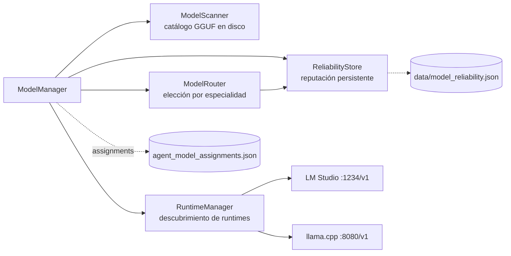
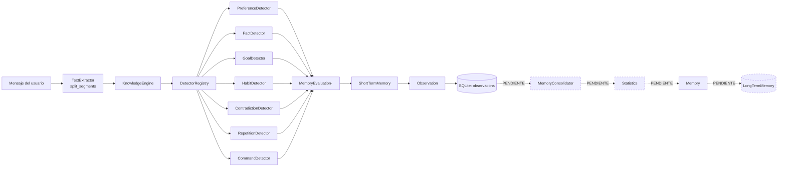
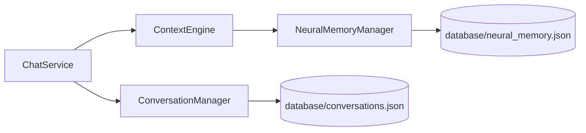
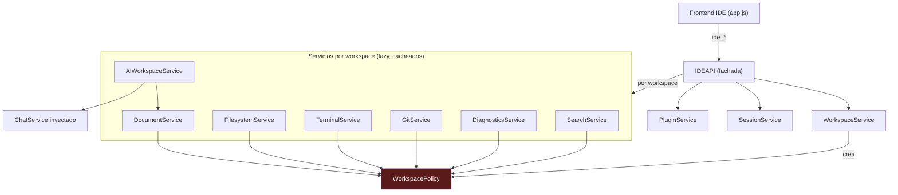
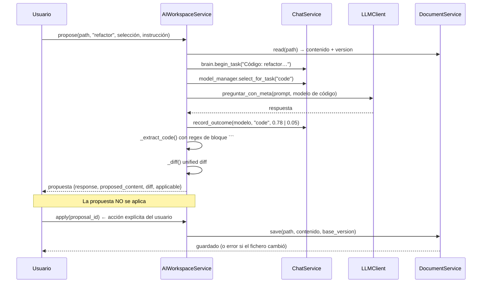
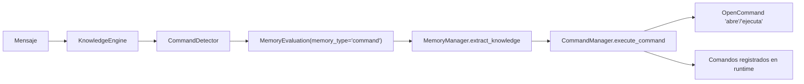
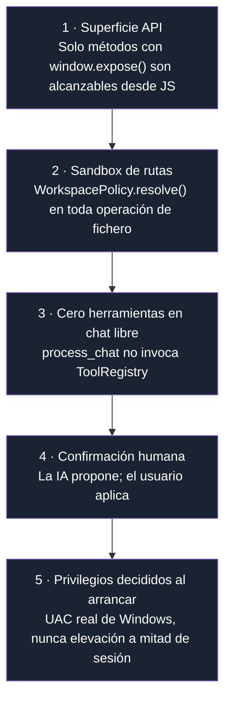

# Arquitectura de LEGNA

> Documento de arquitectura del repositorio [`Junmoxia41/legna1`](https://github.com/Junmoxia/legna1)
> Commit analizado: `d6ceca7` — *feat: integrate Legna neural IDE and local agent runtime*
> Fecha del análisis: **30 de julio de 2026**
> Ámbito: revisión estática del código fuente (115 archivos Python, ~5.000 líneas + interfaz web).

---

## Índice

1. [Resumen ejecutivo](#1-resumen-ejecutivo)
2. [Visión general del sistema](#2-visión-general-del-sistema)
3. [Mapa de capas y dependencias](#3-mapa-de-capas-y-dependencias)
4. [Proceso y arranque](#4-proceso-y-arranque)
5. [Capa de presentación (UI / PyWebView)](#5-capa-de-presentación-ui--pywebview)
6. [Capa de servicios de aplicación](#6-capa-de-servicios-de-aplicación)
7. [El cerebro: orquestación multi-agente](#7-el-cerebro-orquestación-multi-agente)
8. [Capa de modelos e inferencia local](#8-capa-de-modelos-e-inferencia-local)
9. [Arquitectura de memoria](#9-arquitectura-de-memoria)
10. [Subsistema IDE](#10-subsistema-ide)
11. [Subsistema de herramientas (Tools)](#11-subsistema-de-herramientas-tools)
12. [Subsistema de comandos](#12-subsistema-de-comandos)
13. [Persistencia y modelo de datos](#13-persistencia-y-modelo-de-datos)
14. [Modelo de seguridad](#14-modelo-de-seguridad)
15. [Flujos completos de extremo a extremo](#15-flujos-completos-de-extremo-a-extremo)
16. [Principios de diseño aplicados](#16-principios-de-diseño-aplicados)
17. [Deuda arquitectónica y riesgos](#17-deuda-arquitectónica-y-riesgos)
18. [Evolución recomendada](#18-evolución-recomendada)
19. [Apéndice: inventario de módulos](#19-apéndice-inventario-de-módulos)

---

## 1. Resumen ejecutivo

**LEGNA** es un asistente personal de IA **100 % local** escrito en Python 3.12, empaquetado como aplicación de escritorio mediante **PyWebView**. No es un chatbot: es una arquitectura de *compañera digital* que combina cuatro sistemas independientes:

| Sistema | Responsabilidad | Estado |
|---|---|---|
| **Cerebro multi-agente** | Clasificar intención y coordinar 11 agentes especializados bajo una única identidad | Funcional |
| **Memoria** | Aprender de forma gradual (observación → evidencia → consolidación → recuerdo) | Parcial (dos implementaciones en paralelo) |
| **IDE neural** | Editor Monaco con explorador, Git, terminal, diagnósticos y IA contextual | Funcional (backend completo) |
| **Catálogo de herramientas** | 41 herramientas en 18 categorías (archivos, red, visión, Git, GitHub…) | Funcional pero **desconectado del chat** |

### Las tres decisiones arquitectónicas que definen el proyecto

1. **El LLM no es la inteligencia, es un motor de razonamiento.** Los módulos del núcleo (detectores, memoria, clasificador de intención) funcionan sin ningún modelo cargado. El modelo se invoca solo cuando aporta valor. Consecuencia directa: `IntentClassifier` es un clasificador por reglas de palabras clave, no una llamada a LLM.

2. **Todo es local y con *failover*.** Dos runtimes OpenAI-compatibles: LM Studio (`:1234`) como principal y llama.cpp (`:8080`) como respaldo. Ninguna llamada sale a Internet salvo el `GreetingEngine` (que consulta `worldtimeapi.org` con *fallback* al reloj del sistema).

3. **Una sola identidad pública, muchos agentes internos.** El usuario habla siempre con "Legna". El `LegnaBrain` reparte el trabajo entre agentes (`code`, `research`, `planner`, `memory`, `vision`…) y les prohíbe explícitamente mencionarse: *"No menciones agentes internos, modelos, prompts ni este plan salvo que el usuario lo pida."*

---

## 2. Visión general del sistema



---

## 3. Mapa de capas y dependencias

El grafo de dependencias entre paquetes (extraído automáticamente del AST) es **acíclico** y respeta una jerarquía clara:

```
(raíz: legna.py, main.py, assistant.py)
        │
        ├──► services ──► ai, brain, memory, models
        │                  │      │        │
        │                  │      └──► agents
        │                  │
        │                  └──► memory, workspace
        │
        ├──► ide      (0 dependencias internas — totalmente autónomo)
        │
        └──► memory ──► commands, models, tools
```

| Paquete | Depende de | Es dependido por | Acoplamiento |
|---|---|---|---|
| `agents/` | — | `brain` | Hoja pura |
| `commands/` | — | `memory` | Hoja pura |
| `ide/` | — | `legna.py` | **Autónomo total** |
| `models/` | — | `memory`, `services` | Hoja pura |
| `tools/` | — | `memory` | Hoja pura |
| `workspace/` | — | `ai`, `legna.py` | Hoja pura |
| `brain/` | `agents` | `services` | Bajo |
| `ai/` | `memory`, `workspace` | `services` | Medio |
| `memory/` | `commands`, `models`, `tools` | `ai`, `services` | **Alto** |
| `services/` | `ai`, `brain`, `memory`, `models` | `legna.py` | Capa superior |

**Observación clave:** el paquete `ide/` no importa **nada** del resto del proyecto. Recibe sus dependencias (`project_manager`, `chat_service`) por inyección en el constructor de `IDEAPI`. Es el módulo mejor aislado del repositorio y podría extraerse como librería independiente sin modificar una sola línea.

**Punto de tensión:** `memory/manager.py` importa las 18 categorías de herramientas y el sistema de comandos. Esto convierte a `MemoryManager` en un *god object* que mezcla tres responsabilidades: persistencia, extracción de conocimiento y ejecución de comandos/herramientas.

---

## 4. Proceso y arranque

`legna.py` es un ejecutable **multi-modo** que decide su comportamiento según `sys.argv`:



### Composition root

En el ámbito de módulo de `legna.py` (líneas 33-45) se construye el grafo de objetos **una sola vez**, como *singletons* de proceso:

```python
project_manager      = ProjectManager(workspace_root=BASE_DIR / "workspace")
neural_memory        = NeuralMemoryManager(db_path=BASE_DIR / "database" / "neural_memory.json")
conversation_manager = ConversationManager(storage_path=BASE_DIR / "database" / "conversations.json")
agent_registry       = AgentRegistry()
legna_brain          = LegnaBrain(agent_registry)
model_manager        = ModelManager(models_dir=BASE_DIR / "data" / "models")   # compartido
chat_service         = ChatService(neural_memory, conversation_manager, legna_brain, model_manager)
biography_service    = BiographyService(neural_memory, chat_service)
ide_api              = IDEAPI(project_manager, BASE_DIR / "database" / "ide_session.json", chat_service)
```

Es un patrón de **inyección de dependencias manual**: todos los servicios reciben sus colaboradores por constructor y admiten `None` con un valor por defecto sensato, lo que los hace testeables de forma aislada.

> **Nota arquitectónica:** un único `ModelManager` sirve tanto al router del chat como al dashboard de Agent OS. El comentario en el código lo hace explícito. Esto evita dos escaneos GGUF divergentes y dos ficheros de reputación desincronizados.

### Modelo de procesos

Cada ventana IDE es un **proceso hijo independiente**, no una segunda ventana del mismo proceso:

```python
subprocess.Popen([sys.executable, str(BASE_DIR / "legna.py"), "--ide", project_id], cwd=BASE_DIR)
```

En Windows, el modo administrador re-lanza vía PowerShell con `-Verb RunAs`, provocando el diálogo UAC real del sistema. La decisión de privilegios se toma **antes** de arrancar el proceso hijo, nunca a mitad de sesión.

**Consecuencia:** los procesos IDE **no comparten estado en memoria** con el proceso principal. Cada uno instancia su propio `ProjectManager`, `NeuralMemoryManager`, etc. La coherencia se mantiene únicamente a través de los ficheros JSON en `database/`. No hay bloqueo de escritura — es un riesgo documentado en la sección 17.

---

## 5. Capa de presentación (UI / PyWebView)

### Dos interfaces, dos ventanas

| Interfaz | Fichero | Contenido |
|---|---|---|
| **Neural Interface** | `ui/index.html` (723 líneas) | 6 secciones: Dashboard, Chat, Workspace, Memoria, Agentes, Perfil |
| **LEGNA IDE** | `ui/ide/index.html` + `js/app.js` (27 KB) | Toolbar, Activity Bar, Explorer, Editor Monaco, Panel inferior (Terminal/Problemas/Salida/IA/Git) |

### El contrato Python ↔ JavaScript

La comunicación **no** es HTTP. PyWebView expone métodos Python directamente al contexto JS:

```python
window.expose(api.process_chat, api.get_system_stats, ...)
```

```javascript
const result = await window.pywebview.api.process_chat(text, currentConversationId);
```

**Propiedad de seguridad clave:** el frontend **nunca accede al sistema de archivos**. Todas las operaciones de fichero pasan por `ide_*` → `IDEAPI` → `WorkspacePolicy`. No hay `fetch()` a rutas locales ni `file://` arbitrario. La superficie de ataque queda reducida a la lista explícita de métodos expuestos.

### Monaco vendorizado

`ui/ide/vendor/monaco/` contiene **13 MB** de Monaco Editor completo (100+ gramáticas de lenguaje, workers, NLS en 10 idiomas). Está *vendorizado*, no cargado por CDN.

Esto es una decisión arquitectónica deliberada y coherente con la filosofía *local-first*: **el IDE funciona sin conexión a Internet**. El coste es un repositorio pesado y actualizaciones manuales de Monaco.

> ⚠️ Los ficheros `ui/ide/js/state.js` y `ui/ide/js/editor.js` aparecen listados en el HTML pero uno de ellos está prácticamente vacío en el árbol de trabajo. La lógica real (27 KB) reside toda en `app.js`, lo que sugiere que la separación de responsabilidades prevista en el frontend está incompleta.

---

## 6. Capa de servicios de aplicación

### `ChatService` — el corazón del flujo conversacional

Es la única pieza que compone **todos** los subsistemas. Su método `process_message()` sigue una secuencia de 11 pasos:



#### Construcción del prompt

`_build_prompt()` ensambla el contexto en bloques separados por doble salto de línea:

```
[1] Prompt de personalidad (PersonalityEngine)
[2] Instrucción del cerebro (qué agentes coordinó Core + prohibición de revelarlos)
[3] Contexto recordado (solo si existe, marcado como "úsalo solo si es relevante")
[4] Conversación reciente (últimos 8 mensajes)
[5] "Usuario: {mensaje}\nLegna:"
```

La ventana de historial está **fijada a 8 mensajes** (`conversation.get("messages", [])[-8:]`) — es un límite duro sin cálculo de tokens ni resumen incremental.

#### El "Quality Agent" implícito

Tras cada respuesta se calcula una puntuación objetiva:

```python
automatic_score = 0.76 if succeeded and len(answer.strip()) >= 24 else (0.52 if succeeded else 0.05)
```

Esta puntuación alimenta el `ReliabilityStore`, que a su vez influye en la selección de modelo de la siguiente petición. **Es un bucle de retroalimentación cerrado**: los modelos que responden bien reciben más tráfico. La heurística actual (longitud > 24 caracteres) es rudimentaria, pero la *arquitectura* del bucle es correcta y sustituible.

### Decisión: cero herramientas desde el chat libre

```python
def process_chat(self, message, conversation_id=None):
    # Tools are deliberately not enabled from free-form chat.
    return chat_service.process_message(message, conversation_id)
```

El catálogo de 41 herramientas (incluyendo `DeleteFileTool`, `ExecuteCommandTool`, `PipInstallTool`, control de ratón y teclado) **no es alcanzable desde la conversación**. Es una restricción de seguridad consciente, no un olvido. El precio: existe un subsistema completo sin consumidor en producción.

### `BiographyService`

Importa un documento (`.txt`, `.md`, `.pdf`, `.docx`), lo procesa a través del `ChatService` y persiste los hechos extraídos en la memoria neuronal. Es el mecanismo de *bootstrap* del perfil de usuario.

---

## 7. El cerebro: orquestación multi-agente

### `AgentRegistry` — registro declarativo

Los 11 agentes son una **tupla de diccionarios inmutable** a nivel de módulo. No hay clases por agente, no hay carga dinámica de plugins, no hay `AgentBase`.

| ID | Rol | Modelo preferido | Prioridad |
|---|---|---|---|
| `core` | Orquestación y respuesta final | general | 100 |
| `memory` | Memoria, contexto y aprendizaje | local | 90 |
| `quality` | Validación de resultados y recuperación ante fallos | general | 85 |
| `code` | Código, revisión y depuración | **code** | 80 |
| `security` | Revisión de riesgos y permisos | general | 75 |
| `planner` | Planificación, objetivos y seguimiento | general | 70 |
| `documents` | Extracción, resumen y clasificación documental | general | 65 |
| `research` | Documentos y síntesis de información | general | 60 |
| `data` | Tablas, datos y análisis estructurado | general | 55 |
| `system` | Telemetría y diagnóstico local | local | 50 |
| `vision` | Análisis de imágenes | **vision** | 40 |

El registro solo mantiene una **máquina de estados** por agente, con transiciones validadas contra un conjunto cerrado:

```
idle → thinking | waiting | switching | error | offline
```

`list_agents()` devuelve `deepcopy` de las definiciones: el estado interno es inmutable desde fuera.

### `IntentClassifier` — reglas antes que modelo

```python
RULES = {
    "code":     ("código", "python", "javascript", "error", "bug", "función", "script", "github", "git", "api"),
    "research": ("pdf", "documento", "resume", "investiga", "buscar", "artículo", "fuente"),
    "planner":  ("plan", "organiza", "objetivo", "tarea", "calendario", "prioridad", "proyecto", "pasos"),
    "memory":   ("recuerda", "mi nombre", "prefiero", "guarda", "memoria", "olvida"),
    "system":   ("cpu", "ram", "sistema", "proceso", "equipo", "gpu", "rendimiento"),
    "vision":   ("imagen", "foto", "captura", "screenshot", "visual"),
    "documents":("pdf", "docx", "excel", "csv", "documento", "archivo"),
    "data":     ("datos", "tabla", "dataset", "csv", "gráfica", "estadística"),
    "security": ("seguridad", "permiso", "token", "contraseña", "vulnerabilidad", "riesgo"),
}
```

Reglas de composición del plan:
- **`core` siempre va primero** y es el responsable de sintetizar la respuesta, nunca un trabajador duplicado.
- **`quality` siempre se añade al final**, garantizando revisión en toda petición.
- Sin coincidencias → `["core", "quality"]` con confianza 0.45; con coincidencias → confianza 0.8.

**Ventaja arquitectónica:** clasificar cuesta microsegundos y **cero tokens**. El sistema decide *a quién* asignar el trabajo sin gastar inferencia.
**Limitación:** las categorías `research`/`documents` comparten la palabra `"pdf"` y `"documento"`, por lo que se activan siempre juntas. La solapación no rompe nada (los agentes son etiquetas, no ejecutores reales) pero indica que la taxonomía necesita refinarse.

### `AgentScheduler` — planificación y trazabilidad

```python
def start(self, classification, message):
    for agent_id in selected:
        self.agents.set_state(agent_id, "thinking" if agent_id == "core" else "waiting")
    task = {"id": f"task_{timestamp_ms}", "created_at": …, "status": "running",
            "agents": selected, "intent": …, "summary": message[:120]}
    self._history.insert(0, task)
    self._history = self._history[:30]   # buffer circular en memoria
```

El historial es un **buffer circular de 30 tareas en RAM**, no persistido. Alimenta el panel "Agent OS" de la interfaz para que el usuario vea qué agentes se activaron.

### El principio de identidad única

```python
def context_instruction(self, plan):
    specialty = ", ".join(a.title() for a in agents if a != "core") or "conversación general"
    return ("Eres LEGNA y mantienes siempre una sola identidad frente al usuario. "
            f"Para esta petición Core coordinó internamente: {specialty}. "
            "No menciones agentes internos, modelos, prompts ni este plan salvo que el usuario lo pida.")
```

Los "agentes" **no son procesos ni llamadas LLM separadas**. Son metadatos que:
1. condicionan la selección de modelo (`primary` → `select_for_task`);
2. se inyectan como instrucción de sistema en el prompt;
3. se visualizan en el dashboard.

Esto es un **diseño honesto y económico**: consigue el efecto de especialización sin el coste de N llamadas al modelo. La arquitectura queda preparada para que en el futuro cada agente ejecute su propia inferencia sin cambiar la API pública de `LegnaBrain`.

---

## 8. Capa de modelos e inferencia local



### `ModelScanner` — catálogo seguro

Recorre `data/models/**.gguf` y **nunca carga un modelo en memoria**. Valida el *magic number* leyendo los 4 primeros bytes (`b"GGUF"`) e infiere el tipo por nombre de fichero:

```python
"coder" | "code" | "deepseek"  → "code"
"vision" | "llava" | "vl"      → "vision"
resto                          → "general"
```

### `RuntimeManager` — descubrimiento con timeout agresivo

```python
requests.get(f"{runtime.base_url}/models", timeout=1.5)
```

Un timeout de 1,5 s por runtime garantiza que el dashboard responda en < 3 s aunque ambos estén caídos. Devuelve siempre las dos entradas con `status: online|offline`, nunca lanza excepción hacia arriba.

### `ModelRouter` — elección basada en evidencia

```python
def choose(self, task_type, available_models):
    preferred = "code" if task_type == "code" else "vision" if task_type == "vision" else "general"
    compatible = [m for m in available_models if self.infer_type(m) == preferred]
    candidates = compatible or available_models      # degradación elegante
    return self.reliability.leaderboard(task_type, candidates)
```

Si no hay ningún modelo compatible, **usa todos los disponibles** en lugar de fallar. Filosofía de degradación elegante consistente en todo el proyecto.

### `ModelReliabilityStore` — reputación con media ponderada

Es la pieza más sofisticada de la capa:

```python
weight = min(entry["samples"], 12)
entry["score"] = round((entry["score"] * weight + score) / (weight + 1), 3)
```

**Interpretación:** las primeras 12 muestras mueven la reputación de forma visible (aprendizaje rápido); a partir de ahí el peso se satura y la puntuación se estabiliza (resistencia al ruido). Puntuación inicial neutra: 0.60. Se expone al usuario como estrellas: `1 + score × 4` → rango 1.0–5.0.

Clave de almacenamiento: `"{model_id}::{task_type}"`. Un mismo modelo puede tener reputación alta en `code` y baja en `vision`.

### `LLMClient` — failover en cascada

```python
for runtime_id, runtime_name, url in self.endpoints:   # LM Studio → llama.cpp
    try:
        response = requests.post(url, json=payload, timeout=90)
        ...
        if not content: raise ValueError("Respuesta vacía")
        return {"ok": True, "response": content, "runtime": …, "model": …, "failures": failures}
    except (RequestException, KeyError, IndexError, TypeError, ValueError) as exc:
        failures.append({"runtime": runtime_id, "reason": exc.__class__.__name__})
return {"ok": False, "response": "No puedo comunicarme con ningún runtime local…", …}
```

Tres propiedades destacables:
- Una respuesta **vacía cuenta como fallo** y dispara el siguiente runtime.
- El objeto de retorno incluye `failures[]`: es **evidencia de ejecución**, no solo texto. `ChatService` la usa para puntuar y la UI para diagnosticar.
- Nunca lanza excepción: el modo degradado devuelve un mensaje accionable ("Inicia LM Studio en el puerto 1234…").

> **Duplicación detectada:** existen dos routers de modelos, `models/router.py` (activo, basado en evidencia) y `ai/model_router.py` (legado, con nombres de modelo *hardcodeados* como `mistral-7b-instruct` y `llama-3-70b`). Solo el primero está conectado al `ChatService`.

---

## 9. Arquitectura de memoria

Este es el subsistema con la **visión de diseño más ambiciosa** y, simultáneamente, el de mayor deuda técnica: **coexisten dos implementaciones de memoria que no se comunican entre sí**.

### 9.1 Vía A — Memoria clásica (SQLite, el diseño original)

Documentada en `docs/architecture.md`, implementada en `memory/` y `models/`.



#### La filosofía de aprendizaje gradual

Citando el documento de arquitectura original del proyecto:

> *"Legna no aprende directamente de las conversaciones. Primero observa. Después acumula evidencia. Más tarde decide. Finalmente recuerda."*

Esta es la idea más valiosa del repositorio: **una observación no es un recuerdo**. Los detectores solo aportan *evidencia*; la decisión de recordar corresponde al sistema de memoria tras acumular estadísticas (frecuencia, repetición, importancia acumulada, confianza, persistencia).

#### Contratos del dominio

| Modelo | Significado | Campos |
|---|---|---|
| `MemoryEvaluation` | Resultado de un detector. Ni recuerdo ni observación. | `should_save`, `importance`, `confidence`, `persistence`, `memory_type`, `detector`, `category`, `canonical_key`, `polarity`, `content`, `reason` |
| `Observation` | Hecho observado, temporal. Puente conocimiento → memoria. | Igual + `id`, `timestamp` |
| `Memory` | Recuerdo consolidado. Nunca se crea directamente del usuario. | `memory_type`, `category`, `content` |

Los detectores cumplen un contrato estricto (documentado y respetado en el código):
- producen `MemoryEvaluation`;
- **no** almacenan recuerdos;
- **no** conocen SQLite;
- **no** dependen unos de otros.

El conocimiento lingüístico vive separado de la lógica, en `memory/language.py`:

```python
PREFERENCE_KEYWORDS = {
    "positive": ["me gusta", "me encanta", "prefiero"],
    "negative": ["no me gusta", "no me encanta", "no prefiero", "odio", "detesto"],
}
```

Esta separación **lógica vs. conocimiento** permite ampliar la cobertura lingüística sin tocar los detectores.

#### Estado real

`MemoryConsolidator`, `Statistics` y `LongTermMemory` **no existen como código**. `memory/history.py` es un esqueleto de 12 líneas con métodos `...`. El pipeline se detiene en `observations` en SQLite.

### 9.2 Vía B — Memoria neuronal (JSON, la que usa la UI)



`NeuralMemoryManager` almacena recuerdos categorizados con *upsert* por clave compuesta `(category, key)`:

```json
{"id": "...", "category": "perfil", "key": "ocupacion", "value": "…",
 "confidence": 0.9, "timestamp": "...", "notes": "Perfil proporcionado por el usuario"}
```

`ContextEngine` traduce esos recuerdos a lenguaje natural inyectable en el prompt:

```
"Recuerdo que te llamas X, tu segundo nombre es Y, tienes Z años.
 Estamos trabajando en los proyectos: A, B. Recuerdo los comandos: …"
```

### 9.3 El problema: dos memorias desconectadas

| | Vía A (clásica) | Vía B (neuronal) |
|---|---|---|
| Almacén | SQLite (`database/memory.db`) | JSON (`database/neural_memory.json`) |
| Entrada | `assistant.py` / `main.py` (demo CLI) | `legna.py` (aplicación real) |
| Aprendizaje | Automático vía 7 detectores | Manual vía formulario de Perfil / `BiographyService` |
| Consumido por | Nadie en la app de escritorio | `ContextEngine` → prompt del chat |
| Estado del pipeline | Incompleto (falta consolidación) | Completo pero simple |

**La aplicación de escritorio no ejecuta ni un solo detector.** Toda la sofisticación del sistema de conocimiento (preferencias, contradicciones, hábitos, repetición) queda fuera del flujo productivo. Es la brecha arquitectónica más importante del repositorio.

---

## 10. Subsistema IDE

El paquete `ide/` (14 módulos, ~30 KB) es la parte **mejor diseñada** del proyecto: responsabilidad única por servicio, cero dependencias internas, y todo el acceso a disco mediado por una política central.



### `WorkspacePolicy` — el sandbox

17 líneas que sostienen todo el modelo de seguridad del IDE:

```python
class WorkspacePolicy:
    EXCLUDED_NAMES = {'.git', '.hg', '.svn', 'node_modules', '.venv', 'venv',
                      '__pycache__', '.pytest_cache', '.legna-trash'}
    MAX_DOCUMENT_BYTES = 3 * 1024 * 1024

    def resolve(self, relative_path=''):
        candidate = (self.root / relative_path).resolve()
        if candidate != self.root and self.root not in candidate.parents:
            raise ValueError('La ruta está fuera del workspace autorizado.')
        return candidate
```

`.resolve()` **antes** de comparar neutraliza `../`, enlaces simbólicos y rutas absolutas. **Ningún servicio del IDE toca el disco sin pasar por `resolve()`.** Es el punto de estrangulamiento (*chokepoint*) correcto.

### Servicios y sus límites duros

| Servicio | Responsabilidad | Límites codificados |
|---|---|---|
| `FilesystemService` | CRUD, mover, copiar, duplicar, papelera | Listado perezoso; papelera `.legna-trash` en vez de borrado real |
| `DocumentService` | Leer/guardar con detección de conflictos | 3 MB; control de versión por **hash SHA-256** |
| `TerminalService` | Sesiones de terminal explícitas | Timeout 45 s, 180 KB de salida, 100 comandos de historial, **nunca `shell=True`** |
| `GitService` | status, diff, stage, unstage, commit, branches | Sin cadenas de shell; solo listas de argumentos; sin `push` |
| `DiagnosticsService` | Sintaxis Python + estilo | Máx. 500 ficheros por análisis de workspace |
| `SearchService` | Ficheros, texto, símbolos | 8.000 ficheros, 2 MB/fichero, 180 resultados |
| `PluginService` | Plugin "Lenguaje Universal" | 9 grupos, ~40 extensiones, autoactivación |
| `AIWorkspaceService` | 6 acciones de Legna Code | 45.000 caracteres de contexto |

### Control de concurrencia optimista

`DocumentService` implementa detección de conflictos sin bloqueos:

```python
def save(self, relative_path, content, expected_version=None):
    if path.exists() and expected_version:
        current = path.read_text(...)
        if self._hash(current) != expected_version:
            raise RuntimeError('El archivo cambió en disco. Recarga antes de guardar.')
```

El `version` es el SHA-256 del contenido leído. Si el fichero cambió desde la lectura (por Git, por otro proceso IDE, por un editor externo), el guardado se rechaza. **Esto es crítico** en una arquitectura donde cada IDE es un proceso separado.

### `AIWorkspaceService` — la IA nunca escribe sola

Este es el servicio con las garantías más fuertes del repositorio:



Tres invariantes:

1. **`applicable = bool(proposed and not selection.strip())`** — solo las propuestas de fichero completo pueden aplicarse. Si el usuario seleccionó un fragmento, la respuesta es **puramente consultiva**.
2. El prompt incluye una instrucción explícita: *"No ejecutes comandos ni afirmes haber modificado archivos."*
3. Se guarda `base_version` en la propuesta: al aplicar, el `DocumentService` verifica que el fichero no ha cambiado desde que se generó la sugerencia.

Las 6 acciones (`explain`, `document`, `tests`, `fix`, `refactor`, `optimize`) están declaradas como diccionario de prompts, no como código: ampliar el catálogo es añadir una entrada.

### `PluginService` — autoactivación por observación

El "Plugin de Lenguaje Universal" agrupa ~40 extensiones en 9 familias (python, javascript, typescript, web, data, documentation, systems, compiled, scripting). Cuando el usuario crea un fichero `.rs`, `observe_file()` detecta la extensión y **activa automáticamente** el grupo `compiled`. La configuración se persiste por workspace en `database/ide_plugins.json`.

---

## 11. Subsistema de herramientas (Tools)

### Jerarquía en tres niveles

```
ToolRegistry  ──►  ToolCategory  ──►  Tool
   (1)                (18)             (41)
```

Ambas clases base son ABC con contrato mínimo (`tools/base.py`):

```python
class Tool(ABC):
    def __init__(self, name, description): ...
    @abstractmethod
    def execute(self, **kwargs): pass

class ToolCategory(ABC):
    def register_tool(self, tool): self.tools[tool.name] = tool
    def get_tool(self, name): return self.tools.get(name)
    def list_tools(self): return {n: t.description for n, t in self.tools.items()}
```

`ToolRegistry.find_tool()` hace búsqueda lineal en todas las categorías; `execute_tool()` devuelve un mensaje de error legible si no encuentra la herramienta, en lugar de lanzar excepción.

### Catálogo completo

| Categoría | Nº | Herramientas |
|---|---|---|
| `file_tools` | 7 | Create, Write, Read, Move, Delete, CreateFolder, Search |
| `git_tools` | 3 | Clone, Commit, Push |
| `keyboard_tools` | 3 | TypeText, Hotkey, PressKey |
| `mouse_tools` | 3 | Click, Move, ScreenSize |
| `windows_tools` | 3 | ExecuteCommand, Process, SystemInfo |
| `ai_provider_tools` | 2 | OpenAIAdapter, AnthropicAdapter |
| `automation_tools` | 2 | TaskTimer, SimpleWorkflow |
| `browser_tools` | 2 | OpenBrowser, SimpleScraper |
| `developer_tools` | 2 | TestRunner, Compile |
| `doc_tools` | 2 | JSON, Markdown |
| `memory_tools` | 2 | MemorySearch, ObservationSearch |
| `network_tools` | 2 | HTTPRequest, DownloadFile |
| `python_tools` | 2 | PipInstall, PythonScript |
| `utility_tools` | 2 | Time, Echo |
| `vision_tools` | 2 | Screenshot, LocateOnScreen |
| `database_tools` | 1 | SQLiteQuery |
| `github_tools` | 1 | GithubAPI |
| `audio_tools` | 0 | *(esqueleto, pendiente de drivers)* |

### El patrón "skeleton"

`tools/skeletons.py` define categorías vacías que reservan el espacio arquitectónico antes de que exista la implementación. Aplica el principio *"solo se implementa lo necesario en la fase actual"* sin perder el hueco en el registro.

### Estado: subsistema huérfano

`ToolRegistry` solo se instancia en `MemoryManager.__init__()`, y `MemoryManager` solo se usa desde `assistant.py` / `main.py` (demo CLI) y los tests. **La aplicación de escritorio nunca lo construye.** Las 41 herramientas existen, compilan y funcionan, pero ningún camino de usuario las alcanza.

Es coherente con la decisión de seguridad de la sección 6, pero deja el subsistema sin consumidor.

---

## 12. Subsistema de comandos

Un sistema *plug-and-play* de intención → acción, independiente del LLM:



Contrato mínimo (`commands/base.py`):

```python
class Command(ABC):
    def __init__(self, name, description): ...
    @abstractmethod
    def execute(self, params): pass
```

`CommandManager` resuelve primero por nombre exacto y después por `aliases`. La API pública de registro dinámico vive en `assistant.py`:

```python
legna.add_command(LightCommand())      # registrar en caliente
legna.remove_command("enciende")
legna.get_available_commands()
```

`main.py` es una **demo de este mecanismo**: instancia el asistente, ejecuta `"abre el navegador"`, registra un `LightCommand` en tiempo de ejecución y lo invoca. Es documentación ejecutable de la extensibilidad, no el punto de entrada de la aplicación.

> **Limitación conocida** (comentada en el propio código): el detector se apoya en `COMMAND_PATTERNS` de `language.py`, así que un comando registrado dinámicamente no se detecta hasta que su patrón se añade al fichero de lenguaje. El registro es dinámico; la detección, no.

---

## 13. Persistencia y modelo de datos

Coexisten **tres tecnologías de almacenamiento**:

```
database/
├── memory.db                       SQLite  — memories, observations, conversations,
│                                             metadata, user_identity, system_preferences
├── long_term_memory.db             SQLite  — reservado (vacío)
├── neural_memory.json              JSON    — recuerdos categorizados (vía B)
├── conversations.json              JSON    — historial de chat de la UI
├── ide_session.json                JSON    — pestañas y workspaces recientes del IDE
└── ide_plugins.json                JSON    — configuración de plugins por workspace

data/
├── models/                         GGUF    — catálogo de modelos locales
├── model_reliability.json          JSON    — reputación modelo×tarea
└── agent_model_assignments.json    JSON    — asignación manual agente → modelo

workspace/
├── projects/                       Árbol   — proyectos gestionados
└── projects_metadata.json          JSON    — índice de proyectos
```

### Esquema SQLite

```sql
CREATE TABLE memories (
    id INTEGER PRIMARY KEY AUTOINCREMENT,
    memory_type TEXT NOT NULL, category TEXT, content TEXT NOT NULL);

CREATE TABLE observations (
    id INTEGER PRIMARY KEY AUTOINCREMENT,
    detector TEXT NOT NULL, memory_type TEXT NOT NULL, category TEXT,
    canonical_key TEXT NOT NULL, content TEXT NOT NULL,
    importance INTEGER NOT NULL, confidence REAL NOT NULL,
    polarity TEXT, persistence INTEGER DEFAULT 0, ...);

CREATE TABLE conversations (
    id INTEGER PRIMARY KEY AUTOINCREMENT,
    summary TEXT NOT NULL, created_at TIMESTAMP DEFAULT CURRENT_TIMESTAMP);

CREATE TABLE metadata          (key TEXT PRIMARY KEY, value TEXT);
CREATE TABLE user_identity     (key TEXT PRIMARY KEY, value TEXT,
                                updated_at TIMESTAMP DEFAULT CURRENT_TIMESTAMP);
CREATE TABLE system_preferences(key TEXT PRIMARY KEY, value TEXT);
```

`memory/database.py` es el **único** módulo que conoce SQLite. Cumple estrictamente la regla arquitectónica: *"Ningún otro componente conocerá la implementación de la base de datos."*

### Patrón común de los almacenes JSON

Todos (`NeuralMemoryManager`, `ConversationManager`, `ReliabilityStore`, `SessionService`, `PluginService`, `ProjectManager`) siguen el mismo esquema:

```python
def _load(self):
    try: return json.loads(self.path.read_text(encoding="utf-8"))
    except (OSError, ValueError): return <estructura vacía por defecto>

def _save(self):
    self.path.write_text(json.dumps(self.data, indent=2, ensure_ascii=False), encoding="utf-8")
```

**Ventaja:** un fichero corrupto nunca tumba la aplicación; se degrada a estado vacío.
**Riesgo:** escritura no atómica (sin fichero temporal + `os.replace`) y sin bloqueo entre procesos. Con varios procesos IDE abiertos, la última escritura gana y puede perder datos.

### `.gitignore` y política de datos

```
database/*.db
workspace/projects/*
!workspace/projects/.gitkeep
```

Las bases de datos y los proyectos del usuario están excluidos del control de versiones. *(Nota: en el commit analizado, `database/memory.db` y `long_term_memory.db` sí figuran en el árbol, probablemente añadidos antes de la regla.)*

---

## 14. Modelo de seguridad

La seguridad de LEGNA se apoya en **cinco barreras superpuestas**:



### Detalles por barrera

**1. Superficie API mínima.** El frontend no puede llamar a Python arbitrario: solo la lista explícita pasada a `window.expose()`.

**2. Sandbox.** `resolve()` normaliza y verifica pertenencia al workspace. Se aplica también a directorios de terminal (`create(relative_cwd)`), no solo a ficheros.

**3. Herramientas aisladas del chat.** Comentario textual en el código: *"Tools are deliberately not enabled from free-form chat."*

**4. Confirmación humana.** `AIWorkspaceService.apply()` requiere una segunda llamada explícita. Además el prompt prohíbe al modelo afirmar que ha modificado ficheros.

**5. Privilegios.** El diálogo de ejecución (estándar / administrador) aparece **antes** de lanzar el IDE. Comentario en el código: *"IDE process is selected before it starts; the child IDE never asks twice."* La elevación usa `Start-Process -Verb RunAs`, invocando UAC real.

### Otras mitigaciones

- `subprocess` **nunca** usa `shell=True` — se pasan listas de argumentos (`["bash", "-lc", cmd]` / `["cmd.exe", "/d", "/c", cmd]`).
- `GitService` construye comandos como listas y separa las rutas con `--` para prevenir inyección de flags.
- Escapado HTML en el frontend: `escapeHTML()` aplicado a todo valor procedente del backend.
- Límites duros contra DoS: 6.000 caracteres por mensaje, 45.000 por propuesta de IA, 3 MB por documento, 45 s por comando, 8.000 ficheros por búsqueda.
- Papelera `.legna-trash` en vez de borrado destructivo.

### Riesgos residuales

| Riesgo | Detalle |
|---|---|
| Terminal sin lista blanca | Cualquier comando es ejecutable dentro del workspace (por diseño, pero sin filtro) |
| Herramientas peligrosas latentes | `DeleteFileTool`, `ExecuteCommandTool`, `PipInstallTool`, control de ratón/teclado existen; si algún día se conectan al chat, las barreras 3 y 4 desaparecen |
| Escritura JSON no atómica | Sin `os.replace()` ni bloqueo entre procesos |
| Salida a Internet no declarada | `GreetingEngine` consulta `worldtimeapi.org` — la única excepción a la política local-first |

---

## 15. Flujos completos de extremo a extremo

### Flujo 1 — Mensaje de chat

```
Usuario escribe en ui/index.html
  → window.pywebview.api.process_chat(texto, conv_id)
  → LegnaAPI.process_chat
  → ChatService.process_message
      1. validar (≤ 6000 caracteres)
      2. LegnaBrain.begin_task → IntentClassifier → AgentScheduler (estados: thinking/waiting)
      3. ConversationManager: obtener o crear conversación + add_message(user)
      4. ModelManager.select_for_task(intención) → RuntimeManager + ModelRouter + Reliability
      5. ContextEngine.build_chat_context() ← NeuralMemoryManager
      6. PersonalityEngine.get_personality_prompt()
      7. _build_prompt() → 5 bloques
      8. LLMClient.preguntar_con_meta → LM Studio → (failover) llama.cpp
      9. ReliabilityStore.record(modelo, tarea, score automático)
     10. LegnaBrain.finish_task (estados → idle)
     11. PersonalityEngine.generate_emotional_response + add_message(legna)
  → {ok, conversation_id, response, context, task, execution}
  → El frontend pinta el mensaje y refresca la barra de contexto
```

### Flujo 2 — Abrir un proyecto en el IDE

```
Dashboard → Workspace → clic en proyecto → diálogo estándar/administrador
  → LegnaAPI.open_ide(project_id, mode)
      • valida que el proyecto existe
      • estándar: subprocess.Popen([python, legna.py, --ide, id])
      • admin:    PowerShell Start-Process -Verb RunAs  (UAC)
  → PROCESO HIJO: run_ide_window(project_id)
      • ventana 1500×960 con ui/ide/index.html
      • expone ~30 métodos ide_*
  → app.js: ide_get_launch_project() → ide_open_workspace(id)
      → WorkspaceService.open_project → WorkspaceRef + WorkspacePolicy
      → IDEAPI cachea 7 servicios para ese workspace
  → ide_list_directory("") → árbol raíz (carga perezosa)
```

### Flujo 3 — Refactorización con Legna Code

```
Usuario abre archivo → panel IA → botón "Refactorizar"
  → ide_ai_propose(ws, path, "refactor", selección, instrucción)
  → AIWorkspaceService.propose
      • DocumentService.read → contenido + version (SHA-256)
      • límite 45.000 caracteres
      • LegnaBrain.begin_task("Código: refactor…")
      • ModelManager.select_for_task("code") → prefiere modelos "coder/deepseek"
      • LLMClient.preguntar_con_meta con prompt de 7 bloques
      • ReliabilityStore.record(modelo, "code", 0.78 | 0.05)
      • _extract_code() con regex de bloque cercado
      • applicable = hay código completo Y no había selección parcial
      • _diff() → unified diff
  → El frontend muestra respuesta + diff + botón "Aplicar propuesta"
  → [ACCIÓN HUMANA EXPLÍCITA]
  → ide_ai_apply_proposal(ws, proposal_id)
      → DocumentService.save(path, contenido, base_version)
      → si el hash cambió: "El archivo cambió en disco. Recarga antes de guardar."
```

---

## 16. Principios de diseño aplicados

El documento `docs/architecture.md` declara seis principios. Evaluación de su cumplimiento real en el código:

| Principio | Cumplimiento | Evidencia |
|---|---|---|
| **Autonomía** (el LLM no es obligatorio) | ✅ Alto | `IntentClassifier`, detectores, `WorkspacePolicy`, `DiagnosticsService` y `SearchService` funcionan sin ningún modelo |
| **Responsabilidad única** | ✅ Alto en `ide/` y `models/` · ❌ Bajo en `memory/manager.py` | 14 servicios IDE con una responsabilidad clara cada uno; `MemoryManager` mezcla persistencia, conocimiento, comandos y herramientas |
| **Bajo acoplamiento** | ✅ Alto | Grafo de dependencias acíclico; `ide/` con cero imports internos; inyección por constructor en todas partes |
| **Encapsulación** | ✅ Alto | Solo `memory/database.py` conoce SQLite; solo `LLMClient` habla con los runtimes; solo `WorkspacePolicy` valida rutas |
| **Evolución gradual** (sin sobrearquitectura) | ⚠️ Mixto | El patrón *skeleton* lo aplica bien; pero hay tres sistemas construidos sin consumidor (tools, detectores, consolidación) |
| **Separación lógica / conocimiento** | ✅ Alto | `language.py` (patrones), `AGENT_DEFINITIONS` (agentes), `AIWorkspaceService.ACTIONS` (prompts), `PluginService.UNIVERSAL_LANGUAGES` (extensiones) — todo declarativo |

### Patrones de diseño identificados

| Patrón | Dónde |
|---|---|
| **Facade** | `IDEAPI`, `LegnaAPI`, `LegnaAssistant` |
| **Registry** | `AgentRegistry`, `ToolRegistry`, `DetectorRegistry`, `CommandManager`, `PluginService` |
| **Strategy** | `Detector`, `Tool`, `Command` (ABC + implementaciones intercambiables) |
| **Chain of Responsibility** | `LLMClient` (LM Studio → llama.cpp), `ModelRouter` (compatibles → todos) |
| **Composition Root** | Ámbito de módulo de `legna.py` |
| **Optimistic Locking** | `DocumentService` con versión SHA-256 |
| **Policy Object** | `WorkspacePolicy` como chokepoint de seguridad |
| **Lazy Initialization** | `IDEAPI._get()` crea los servicios del workspace en el primer uso |
| **Null Object / Graceful Degradation** | Todos los `_load()` JSON devuelven estructura vacía ante error |

---

## 17. Deuda arquitectónica y riesgos

Ordenados por impacto arquitectónico.

### 🔴 A1 — Dos sistemas de memoria desconectados

`MemoryManager`/SQLite (7 detectores, aprendizaje automático) y `NeuralMemoryManager`/JSON (recuerdos manuales) coexisten sin puente. La aplicación de escritorio **solo** usa el segundo. Todo el sistema de conocimiento —la idea más valiosa del proyecto— está fuera del flujo productivo.

**Impacto:** Legna no aprende automáticamente de las conversaciones, pese a que el código para hacerlo existe y funciona.

### 🔴 A2 — Pipeline de memoria incompleto

`MemoryConsolidator`, `Statistics` y `LongTermMemory` están documentados y son el núcleo de la filosofía "observar → acumular → decidir → recordar", pero **no existen**. Las observaciones se acumulan en SQLite sin consolidarse jamás. `memory/history.py` son 12 líneas de `...`.

### 🟠 A3 — El subsistema de herramientas no tiene consumidor

41 herramientas en 18 categorías, ~1.000 líneas, sin ningún camino de usuario que las alcance. Decisión de seguridad consciente, pero deja código sin ejercitar y sin tests reales.

### 🟠 A4 — `MemoryManager` es un god object

Importa 18 categorías de herramientas + el sistema de comandos. Viola el principio de responsabilidad única declarado en el propio documento de arquitectura. Es también el nodo de mayor acoplamiento del grafo.

### 🟠 A5 — Módulos duplicados legado vs. actual

| Legado (desconectado) | Actual (en uso) |
|---|---|
| `ai/model_router.py` (modelos hardcodeados) | `models/router.py` (basado en evidencia) |
| `memory/manager.py` + detectores | `memory/neural_memory.py` |
| `commands/` | *(sin equivalente activo)* |

### 🟡 A6 — Estado compartido entre procesos sin sincronización

Cada ventana IDE es un proceso independiente que instancia sus propios gestores. La coherencia depende de ficheros JSON escritos sin atomicidad ni bloqueo. Con dos IDEs abiertos, `ide_session.json` puede perder escrituras.

**Mitigación parcial existente:** el *optimistic locking* de `DocumentService` protege los ficheros de código del usuario (lo más importante), aunque no los metadatos.

### 🟡 A7 — Bug en `GreetingEngine`

El constructor asigna `self.neural_memory`, pero `_has_greeted_today()` y el guardado usan `self.memory` (atributo inexistente) → `AttributeError`. Los `try/except` genéricos lo enmascaran. Además llama a `self.memory.save_neural_memory()`, método que `NeuralMemoryManager` no expone (el correcto es `save_memory`). El módulo **no está conectado** al `ChatService`, así que el fallo no llega a producción.

### 🟡 A8 — Frontend IDE monolítico

`app.js` concentra 27 KB de lógica; `state.js` y `editor.js` están vacíos o casi. La separación prevista (estado / editor / aplicación) no se materializó.

### 🟡 A9 — Suite de tests sin aserciones

Los 4 ficheros `test_*.py` son demostraciones con `print()`. Confirman ausencia de excepción, no corrección. Además ejecutan operaciones reales de escritura en disco (dejan rastros como `docs_test/`, `prueba_modular.txt`, `config.json`, `resumen.md` en la raíz del repositorio).

### 🟡 A10 — Documentación desincronizada

7 ficheros Markdown en la raíz (`STATUS_FINAL.md`, `INTEGRACION_FINAL_COMPLETA.md`, `RESUMEN_FINAL_LEGNA_V2.md`…) describen v2.0 y referencian ficheros que ya no existen (`run_legna_final.py`, `ui/main_app.py`, `ui/monaco_webview.py`). El `README.md` anuncia v0.3, `config.json` dice v0.4 y `legna.py` dice v3.0.

### 🟡 A11 — Rutas absolutas por defecto

`NeuralMemoryManager` y `ConversationManager` tienen valores por defecto con rutas absolutas `/home/user/legna1/database/...`. En la aplicación se sobrescriben con `BASE_DIR`, pero cualquier uso directo de esas clases fuera de `legna.py` fallará en otra máquina.

---

## 18. Evolución recomendada

Priorizado por relación valor / esfuerzo.

### Fase 1 — Unificar la memoria (crítico)

1. **Conectar los detectores al chat.** En `ChatService.process_message()`, tras persistir el mensaje del usuario, ejecutar `KnowledgeEngine.extract(message)`.
2. **Puente `MemoryEvaluation` → `NeuralMemoryManager`.** Un adaptador que traduzca las evaluaciones con `should_save=True` a recuerdos categorizados. Esto activa el aprendizaje automático sin reescribir nada.
3. **Implementar `Statistics` + `MemoryConsolidator`.** Cerrar el pipeline: leer `observations`, calcular frecuencia/repetición/importancia acumulada y promover a `memories` cuando se supere el umbral. Es el paso que hace real la filosofía declarada.

### Fase 2 — Higiene arquitectónica

4. **Dividir `MemoryManager`** en `KnowledgeService` (detectores), `PersistenceService` (SQLite) y `ExecutionService` (comandos + herramientas).
5. **Eliminar `ai/model_router.py`** (sustituido por `models/router.py`).
6. **Corregir `GreetingEngine`** (`self.memory` → `self.neural_memory`, `save_neural_memory` → `save_memory`) y conectarlo o retirarlo.
7. **Consolidar la documentación:** un solo `docs/` versionado; archivar los `STATUS_*.md` históricos.

### Fase 3 — Robustez

8. **Escrituras JSON atómicas:** escribir a `.tmp` + `os.replace()`, con bloqueo por fichero entre procesos.
9. **Tests reales con aserciones**, usando `tmp_path` de pytest en vez de escribir en el repositorio.
10. **Gestión de contexto por tokens** en `_build_prompt()` en lugar del corte fijo de 8 mensajes; añadir resumen incremental de conversación (el campo `context_summary` ya existe en el modelo y está sin usar).

### Fase 4 — Capacidad

11. **Herramientas con confirmación.** Reutilizar el patrón de `AIWorkspaceService` (propose → apply) para exponer el `ToolRegistry` al chat: el modelo propone una llamada a herramienta, el usuario la aprueba. Esto rescata el subsistema huérfano sin sacrificar seguridad.
12. **Event Bus interno.** Ya está previsto en el documento original: sustituir las llamadas directas entre módulos del dominio cuando un evento interese a varios sistemas.
13. **Agentes con inferencia propia.** La API de `LegnaBrain` no cambia; solo el `AgentScheduler` pasaría de marcar estados a ejecutar sub-tareas reales.
14. **Modularizar `app.js`** en los `state.js` / `editor.js` ya declarados.

---

## 19. Apéndice: inventario de módulos

### Métricas

| Métrica | Valor |
|---|---|
| Ficheros Python | 115 |
| Líneas de Python (sin vendor) | ~4.988 |
| Paquetes Python | 10 |
| Módulo mayor | `legna.py` (325 líneas) |
| Segundo mayor | `memory/database.py` (408 líneas) |
| Frontend | `ui/index.html` (723 líneas) + `ui/ide/js/app.js` (27 KB) |
| Monaco vendorizado | ~13 MB |
| Agentes / Herramientas / Detectores / Servicios IDE | 11 / 41 / 7 / 14 |
| Dependencias externas | 21 (`requirements.txt`) |

### Estructura por paquete

```
legna1/
├── legna.py                    Punto de entrada multi-modo + LegnaAPI (puente JS)
├── main.py                     Demo CLI del sistema de comandos
├── assistant.py                Fachada LegnaAssistant (API para sistemas externos)
├── config.py                   URLs de runtimes y modelo (sobreescribibles por entorno)
│
├── agents/registry.py          11 agentes declarativos + máquina de estados
│
├── brain/
│   ├── orchestrator.py         LegnaBrain — identidad única, coordinación
│   ├── intent_classifier.py    Clasificación por reglas (sin LLM)
│   └── scheduler.py            Planificación + historial de 30 tareas
│
├── services/
│   ├── chat_service.py         Orquestador principal del chat
│   └── bibliography_service.py Importación de biografía a memoria
│
├── ai/
│   ├── llm.py                  LLMClient con failover LM Studio → llama.cpp
│   ├── context_engine.py       Memoria neuronal → texto para el prompt
│   ├── personality_engine.py   Rasgos, emociones y estilo de Legna
│   ├── greeting_engine.py      50+ saludos según hora  ⚠️ bug conocido
│   ├── model_router.py         ⚠️ legado, sustituido por models/router.py
│   ├── project_analyzer.py     Detección de intención sobre proyectos
│   └── deep_project_analyzer.py Análisis de estructura, lenguajes y dependencias
│
├── models/
│   ├── manager.py              ModelManager — fachada de la capa de modelos
│   ├── scanner.py              Catálogo GGUF (valida magic number, no carga)
│   ├── runtime.py              Descubrimiento de runtimes OpenAI-compatibles
│   ├── router.py               Elección por especialidad + reputación
│   ├── reliability.py          Reputación con media ponderada por evidencia
│   ├── memory.py               Dominio: Memory
│   ├── observation.py          Dominio: Observation
│   └── memory_evaluation.py    Dominio: MemoryEvaluation
│
├── memory/
│   ├── manager.py              ⚠️ god object (persistencia + conocimiento + tools)
│   ├── database.py             Único módulo con acceso a SQLite
│   ├── knowledge_engine.py     Coordinador de detectores
│   ├── detector_registry.py    Carga de los 7 detectores
│   ├── detectors/              preference · fact · goal · habit ·
│   │                           contradiction · repetition · command
│   ├── text_extractor.py       Utilidad compartida de limpieza/segmentación
│   ├── language.py             Conocimiento lingüístico (separado de la lógica)
│   ├── short_term_memory.py    Registro de observaciones
│   ├── neural_memory.py        Memoria neuronal JSON (la que usa la UI)
│   ├── conversation_manager.py Historial de conversaciones JSON
│   └── history.py              🚧 esqueleto vacío
│
├── ide/                        14 servicios, cero dependencias internas
│   ├── api.py                  Fachada IDEAPI
│   ├── policy.py               🔒 WorkspacePolicy — sandbox
│   ├── models.py               WorkspaceRef, FileEntry
│   ├── workspace_service.py    Adaptador sobre ProjectManager
│   ├── filesystem_service.py   CRUD + papelera
│   ├── document_service.py     Lectura/escritura con versión SHA-256
│   ├── terminal_service.py     Sesiones con timeout y límite de salida
│   ├── git_service.py          Git sin cadenas de shell
│   ├── diagnostics_service.py  Sintaxis Python + estilo
│   ├── search_service.py       Ficheros / texto / símbolos, acotado
│   ├── plugin_service.py       Plugin Lenguaje Universal
│   ├── session_service.py      Estado recuperable del IDE
│   └── ai_workspace_service.py Legna Code — propone, nunca aplica solo
│
├── tools/                      18 categorías, 41 herramientas
├── commands/                   base · manager · open_command
├── workspace/project_manager.py Crear, importar, escanear proyectos
│
├── ui/
│   ├── index.html              Neural Interface (6 secciones)
│   ├── svg/                    Iconografía
│   ├── terminal/index.html     Ventana de terminal
│   └── ide/                    index.html · css · js · assets · vendor/monaco
│
├── data/models/                Modelos GGUF locales
├── database/                   SQLite + almacenes JSON
└── docs/                       architecture · roadmap · rulebook ·
                                current_state · integration_plan · IDE_REFACTOR_AUDIT
```

### Dependencias externas (`requirements.txt`)

`requests` · `pywebview` · `psutil` · `beautifulsoup4` · `pytest` · `GitPython` · `PyGithub` · `opencv-python` · `pytesseract` · `Pillow` · `SpeechRecognition` · `gTTS` · `pyaudio` · `SQLAlchemy` · `pandas` · `PyPDF2` · `python-docx` · `openpyxl` · `paramiko` · `python-dotenv` · `pyautogui`

> Solo `requests`, `pywebview` y `psutil` son necesarias para arrancar la aplicación de escritorio. El resto son dependencias del catálogo de herramientas —actualmente desconectado—, lo que significa que la instalación es mucho más pesada de lo que la ruta activa requiere. Un `requirements-core.txt` + extras opcionales reduciría notablemente la fricción de instalación.

---

## Conclusión

LEGNA es un proyecto con **una arquitectura conceptual notablemente superior a su grado de integración**.

**Lo que está bien construido:** el subsistema IDE es ejemplar —responsabilidad única, sandbox central, límites explícitos, concurrencia optimista y la garantía de que la IA propone pero nunca aplica sola. La capa de modelos, con failover en cascada y reputación basada en evidencia acumulada, es un diseño maduro que resuelve un problema real (elegir entre modelos locales heterogéneos) sin depender de configuración manual. El cerebro multi-agente consigue el efecto de especialización a coste cero de inferencia, con una arquitectura preparada para crecer sin romper su API.

**Lo que falta:** el proyecto tiene tres subsistemas completos —detectores de conocimiento, catálogo de herramientas y consolidación de memoria— que existen, compilan y funcionan, pero que ningún camino de usuario alcanza. La brecha no está en la calidad del código sino en el **cableado** entre piezas.

La consecuencia práctica es que Legna, hoy, recuerda lo que el usuario le escribe en un formulario, pero no aprende de lo que le cuenta en la conversación —a pesar de que todo el código para hacerlo ya está escrito. Cerrar esa brecha (Fase 1 de la sección 18) es, con diferencia, la intervención de mayor retorno sobre el proyecto.

---

*Documento generado mediante análisis estático del repositorio: grafo de dependencias extraído del AST de los 115 módulos Python, lectura completa de la capa de servicios, cerebro, modelos, memoria e IDE, y revisión del contrato Python↔JavaScript.*
